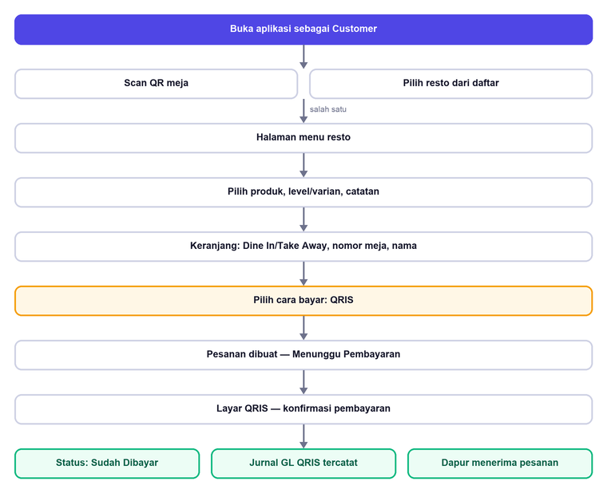
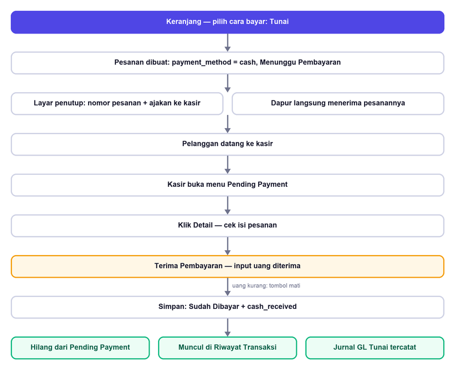
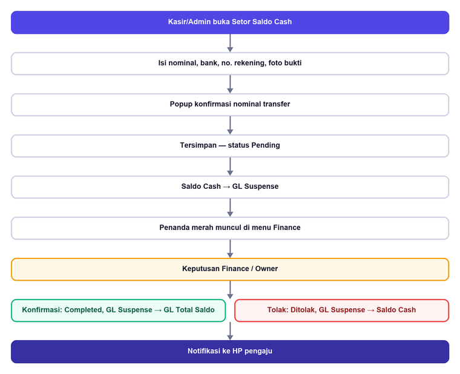
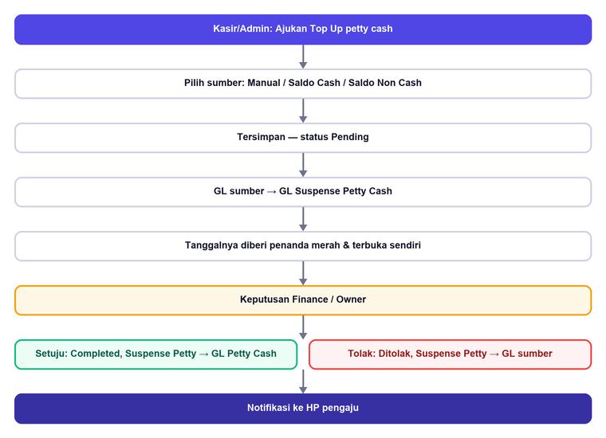
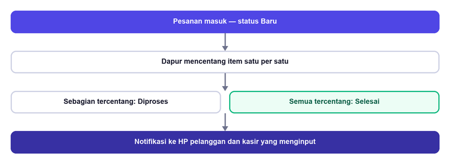

# KaataGo — Functional Specification Document

**Versi Aplikasi:** 1.37.0 (build 76)
**Versi Dokumen:** 1.0
**Tanggal Terbit:** 15 Agustus 2026
**Status:** Rilis
**Jenis Dokumen:** FSD — sisi fungsional

Dokumen ini menjelaskan **apa** yang dilakukan KaataGo: siapa memakainya,
proses apa yang dijalankan, aturan apa yang berlaku, dan hasil apa yang
diharapkan. Sisi teknisnya — arsitektur, tabel, kebijakan keamanan baris
— ada di dokumen terpisah (`SPESIFIKASI-KAATAGO`).

Isinya diambil dari aplikasi yang berjalan, bukan dari rencana. Setiap
perbedaan antara dokumen ini dan aplikasinya adalah temuan yang layak
dilaporkan.

---

## Daftar Isi

1. Ruang Lingkup
2. Peran Pengguna
3. Proses Bisnis Utama
4. Kebutuhan Fungsional per Modul
5. Aturan Bisnis
6. Aturan Validasi Isian
7. Daftar Status
8. Notifikasi
9. Kriteria Penerimaan
10. Batasan yang Diketahui

---

## 1. Ruang Lingkup

KaataGo adalah aplikasi kasir sekaligus pemesanan mandiri untuk rumah
makan di Indonesia. Satu aplikasi melayani dua kelompok yang sangat
berbeda: **pelanggan**, yang memesan dari HP sendiri, dan **karyawan
resto** — kasir, dapur, admin, keuangan, pemilik — yang masing-masing
melihat menu berbeda begitu masuk.

### 1.1 Yang termasuk

| Bidang | Cakupan |
|---|---|
| Pemesanan | Pesan mandiri dari HP pelanggan (scan QR meja atau pilih resto), dan input pesanan oleh kasir |
| Pembayaran | QRIS, Tunai, Transfer; pelanggan boleh memilih bayar tunai di kasir |
| Dapur | Antrean masak per status, centang per menu |
| Keuangan | Pemasukan, pengeluaran, petty cash, setoran tunai, jurnal GL otomatis |
| Katalog | Produk, kategori, level/varian, stok, banner promo |
| Organisasi | Karyawan, banyak resto per akun, QR meja |
| Komunikasi | Kotak masuk pengumuman, notifikasi push |

### 1.2 Yang tidak termasuk

| Hal | Keterangan |
|---|---|
| Pembayaran QRIS sungguhan | Kode QR dibangkitkan dari data merchant, tapi **tidak terhubung** ke penyedia pembayaran. Konfirmasinya manual |
| Pencocokan mutasi bank | Transfer dan setoran dipastikan manual oleh Finance |
| Aplikasi iOS | Rilis saat ini hanya Android |
| Pengiriman/kurir | Take Away berarti diambil sendiri |

---

## 2. Peran Pengguna

Login karyawan **hanya lewat Google Sign-In**, dan alamatnya harus sudah
terdaftar. Pelanggan boleh memesan **tanpa akun sama sekali**.

| Peran | Tugas utamanya |
|---|---|
| **Customer** | Memesan dari HP sendiri, membayar, memantau status pesanannya |
| **Kasir** | Menerima pesanan di konter, menerima pembayaran, menyetor tunai |
| **Chef** | Menjalankan antrean dapur |
| **Admin** | Katalog, karyawan, pengaturan resto, QR meja, pengumuman resto |
| **Finance** | Memutuskan setoran & petty cash, pemetaan GL, laporan |
| **Owner** | Seluruh menu di restonya, dan berpindah antar cabang |
| **Super Admin** | Seluruh resto, dan pengumuman versi aplikasi |

### 2.1 Matriks akses menu

| Menu | Super Admin | Owner | Admin | Kasir | Chef | Finance | Customer |
|---|:--:|:--:|:--:|:--:|:--:|:--:|:--:|
| Kasir / Input Pesanan | – | ✔ | ✔ | ✔ | – | – | – |
| Pesanan Masuk | – | ✔ | ✔ | – | – | – | – |
| Layar Dapur | – | ✔ | – | – | ✔ | – | – |
| Pending Payment | – | ✔ | ✔ | ✔ | – | – | – |
| Riwayat Transaksi | – | ✔ | ✔ | ✔ | – | – | – |
| Pemasukan | – | ✔ | – | – | – | ✔ | – |
| Saldo & Pengeluaran | – | ✔ | ✔ | ✔ | – | ✔ | – |
| Setor Saldo Cash | – | ✔ | ✔ | ✔ | – | ✔ | – |
| Mapping GL Account | – | ✔ | – | – | – | ✔ | – |
| Jurnal GL | – | ✔ | – | – | – | ✔ | – |
| Laporan Transaksi | – | ✔ | – | – | – | ✔ | – |
| Kelola Produk | – | ✔ | ✔ | – | – | – | – |
| Pengaturan Resto & QR Meja | – | ✔ | ✔ | – | – | – | – |
| Pengaturan Pembayaran | – | ✔ | – | – | – | ✔ | – |
| Kelola Karyawan | ✔ | ✔ | ✔ | – | – | – | – |
| List Resto | ✔ | – | – | – | – | – | – |
| Kirim Pengumuman | ✔ | ✔ | ✔ | – | – | – | – |
| Kotak Masuk | ✔ | ✔ | ✔ | ✔ | ✔ | ✔ | – |
| Pesan / Profil / Riwayat | – | – | – | – | – | – | ✔ |

### 2.2 Pemisahan wewenang

> **Yang mengajukan tidak boleh menyetujui.** Kasir dan Admin
> **mengajukan** setoran tunai dan top up petty cash. Finance dan Owner
> yang **memutuskan**. Aturan ini berlaku mutlak: tombolnya tidak muncul
> di aplikasi, dan permintaannya ditolak di sisi server sekalipun
> dipaksakan.

> **Pengumuman versi aplikasi hanya dari Super Admin.** Admin resto boleh
> mengirim pengumuman umum untuk restonya sendiri, tapi tidak
> pemberitahuan versi — dia tidak punya cara mengetahui versi mana yang
> sebenarnya sudah dirilis.

---

## 3. Proses Bisnis Utama

### 3.1 Pelanggan pesan sendiri — bayar QRIS



### 3.2 Pelanggan pesan sendiri — bayar tunai di kasir



Pesanannya **selesai dibuat saat itu juga** dan langsung diteruskan ke
dapur. Yang tertunda hanya uangnya. Pelanggan diberi nomor pesanan dan
diarahkan ke kasir; kasir menyelesaikannya lewat menu Pending Payment.

### 3.3 Setor saldo tunai



### 3.4 Top up petty cash



Perbedaannya dengan setoran tunai: perantaranya **GL Suspense Petty
Cash**, tombolnya berbunyi *Setuju*/*Tolak* (setoran: *Konfirmasi*/
*Tolak*), dan top up yang dibuat Finance sendiri langsung berstatus
selesai — tidak ada gunanya menyetujui permintaan sendiri.

### 3.5 Alur dapur



---

## 4. Kebutuhan Fungsional per Modul

### 4.1 Pemesanan Mandiri (Customer)

| ID | Kebutuhan |
|---|---|
| F-CU-01 | Pelanggan dapat memesan tanpa akun (tamu) maupun dengan akun Google |
| F-CU-02 | Masuk ke menu resto lewat scan QR meja **atau** memilih resto dari daftar |
| F-CU-03 | Scan QR meja mengisi nomor mejanya otomatis dan menguncinya |
| F-CU-04 | Memilih level/varian dan menuliskan catatan per menu |
| F-CU-05 | Satu produk dengan varian berbeda menjadi **baris terpisah** di keranjang |
| F-CU-06 | Menu yang telanjur ditambahkan dapat dihapus atau diubah dari keranjang |
| F-CU-07 | Memilih **Dine In** atau **Take Away**; Take Away tidak meminta nomor meja |
| F-CU-08 | Nama pemesan wajib diisi pada kedua jenis |
| F-CU-09 | Memilih cara bayar: **QRIS** atau **Tunai** (bayar di kasir) |
| F-CU-10 | Ringkasan tagihan menampilkan subtotal, biaya service, PPN, dan total |
| F-CU-11 | Memantau status pesanannya secara langsung tanpa perlu menyegarkan |
| F-CU-12 | Melihat riwayat pesanan; tamu tetap melihat riwayat dari perangkatnya |
| F-CU-13 | Riwayat tamu berpindah ke akunnya saat pertama kali login |
| F-CU-14 | Mengatur nama, nomor HP, dan foto profil; foto dapat **dihapus** |
| F-CU-15 | Melihat lokasi resto dan membukanya di Google Maps |
| F-CU-16 | Melihat banner promo resto **utuh, tidak terpotong** |

### 4.2 Kasir

| ID | Kebutuhan |
|---|---|
| F-KS-01 | Memilih produk dari daftar per kategori, dengan stok berkurang saat checkout |
| F-KS-02 | Menerima pembayaran Tunai, QRIS, atau Transfer |
| F-KS-03 | Pembayaran tunai menampilkan uang diterima, kembalian, dan saran nominal |
| F-KS-04 | Tombol terima pembayaran mati selama uang yang dimasukkan kurang dari total |
| F-KS-05 | Struk dapat disimpan ke galeri, dibagikan, dan dicetak |
| F-KS-06 | Struk transaksi lama dapat ditampilkan dan dicetak ulang dari riwayat |
| F-KS-07 | Riwayat transaksi dikelompokkan per hari berikut rincian per metode bayar |

### 4.3 Pending Payment

| ID | Kebutuhan |
|---|---|
| F-PP-01 | Menampilkan pesanan mandiri berstatus menunggu pembayaran dengan cara bayar tunai |
| F-PP-02 | Menampilkan jumlah pesanan dan total nominal yang menunggu |
| F-PP-03 | Rincian pesanan dapat dibuka: item, catatan, biaya service, PPN, total |
| F-PP-04 | Menerima pembayaran memakai dialog yang sama dengan checkout kasir |
| F-PP-05 | Satu pesanan tidak dapat dilunasi dua kali oleh ketukan beruntun |
| F-PP-06 | Pesanan yang lunas **hilang seketika** dari antrean tanpa perlu menyegarkan |
| F-PP-07 | Pesanan yang lunas **muncul di Riwayat Transaksi** dan ikut dihitung pada total harian |
| F-PP-08 | Kartu menunya membawa penanda merah berisi jumlah antrean |

**Negatif:** pesanan QRIS yang belum dibayar dan pesanan yang diinput
kasir **tidak boleh** muncul di daftar ini.

### 4.4 Dapur

| ID | Kebutuhan |
|---|---|
| F-CH-01 | Tiga tab: Baru, Diproses, Selesai |
| F-CH-02 | Mencentang menu satu per satu; sebagian tercentang → Diproses, seluruhnya → Selesai |
| F-CH-03 | Pesanan selesai dikelompokkan per tanggal, tertutup secara bawaan |
| F-CH-04 | Kotak masuk dapat dibuka dari layar dapur berikut penanda belum dibaca |
| F-CH-05 | Owner yang membuka layar dapur tidak melihat tombol Keluar dan Kotak Masuk |

### 4.5 Keuangan

| ID | Kebutuhan |
|---|---|
| F-FN-01 | Saldo total = Penghasilan + Petty Cash + Setoran − Pengeluaran |
| F-FN-02 | Penghasilan dipisah **Cash** dan **Non Cash**; angka tunai harus cocok dengan isi laci |
| F-FN-03 | Mengajukan/menambah top up petty cash dari tiga sumber dana |
| F-FN-04 | Mencatat pengeluaran, selalu diambil dari petty cash, dibatasi saldo tersedia |
| F-FN-05 | Melampirkan foto nota pada pengeluaran |
| F-FN-06 | Riwayat dikelompokkan per tanggal, **tertutup secara bawaan** |
| F-FN-07 | Tanggal yang menyimpan pengajuan **terbuka sendiri** dan diberi penanda merah |
| F-FN-08 | Setiap baris dapat dibuka untuk melihat jurnal GL di baliknya |
| F-FN-09 | Memetakan nomor GL untuk tiap metode bayar, PPN, service, dan akun perantara |
| F-FN-10 | Mengatur tarif PPN dan biaya service |
| F-FN-11 | Mencetak/mengekspor laporan transaksi bergaya rekening koran |

### 4.6 Setor Saldo Cash

| ID | Kebutuhan |
|---|---|
| F-SD-01 | Mengajukan setoran: nominal, catatan, dan foto bukti transfer |
| F-SD-02 | Nama bank, nomor rekening, dan nama pemilik **hanya ditampilkan**, mengikuti Pengaturan Pembayaran |
| F-SD-03 | Tombol simpan mati bila rekening resto belum diatur |
| F-SD-04 | Popup konfirmasi mengingatkan agar nominalnya sesuai yang benar-benar ditransfer |
| F-SD-05 | Finance mengonfirmasi atau menolak; keputusannya mengembalikan atau meneruskan dananya |
| F-SD-06 | Foto bukti dapat dibuka besar |
| F-SD-07 | Kartu menunya membawa penanda merah berisi jumlah pengajuan menunggu |

### 4.7 Katalog & Pengaturan Resto

| ID | Kebutuhan |
|---|---|
| F-AD-01 | Menambah, mengubah, menonaktifkan produk berikut foto, deskripsi, harga, stok |
| F-AD-02 | Harga diisi sebagai **harga bersih**; harga jual dihitung otomatis |
| F-AD-03 | Menandai produk bebas PPN |
| F-AD-04 | Mengelola kategori dan level/varian |
| F-AD-05 | Mengelola karyawan; **email dapat diubah** tanpa kehilangan riwayat |
| F-AD-06 | Mengatur info resto, termasuk mengambil titik lokasi sekali tekan |
| F-AD-07 | Mengunggah banner promo, mengaktifkan/menonaktifkan, dan mengurutkannya |
| F-AD-08 | Akun dengan beberapa cabang dapat berpindah resto tanpa logout |

### 4.8 QR Meja

| ID | Kebutuhan |
|---|---|
| F-QR-01 | Membuat QR untuk satu meja dengan nomor bebas ("7", "A01", "VIP-2") |
| F-QR-02 | Membuat banyak meja sekaligus: **isi jumlah mejanya**, misal 10 → 10 QR bernomor 1–10. Maksimal **100** |
| F-QR-03 | Awalan opsional; diisi "A" menghasilkan A1, A2, A3, … |
| F-QR-07 | Nomor meja ditulis polos (`7`, bukan `07`) supaya sama dengan mode satu meja; urutan berkas di galeri dijaga lewat nama berkasnya |
| F-QR-04 | Kartunya bergaya KaataGo, memuat nama resto dan nomor meja |
| F-QR-05 | Menyimpan ke galeri satuan maupun **seluruhnya sekaligus**, dengan penghitung kemajuan |
| F-QR-06 | Membagikan dan mencetak, satu meja satu halaman |

### 4.9 Kotak Masuk & Pengumuman

| ID | Kebutuhan |
|---|---|
| F-IN-01 | Kotak masuk terbagi dua tab: **Update Aplikasi** dan **General** |
| F-IN-02 | Tiap tab menampilkan jumlah pesan belum dibaca sendiri-sendiri |
| F-IN-03 | Pesan dapat dihapus satuan maupun seluruhnya; hanya hilang dari kotak masuk orang itu |
| F-IN-04 | Pengumuman versi memuat tombol **Unduh Versi Terbaru** |
| F-IN-05 | Unduhan berjalan **di dalam aplikasi** berikut persen kemajuan, lalu membuka pemasangnya |
| F-IN-06 | Tersedia jalur cadangan mengunduh lewat browser |
| F-IN-07 | Super Admin mengirim pengumuman versi maupun umum ke seluruh resto |
| F-IN-08 | Admin/Owner mengirim pengumuman umum untuk restonya sendiri |
| F-IN-09 | Pengumuman umum dapat memuat **gambar promo** |
| F-IN-10 | Pengumuman milik sebuah resto tidak muncul di kotak masuk resto lain |

---

## 5. Aturan Bisnis

### 5.1 Perhitungan tagihan

```
service = harga bersih × tarif service
ppn     = (harga bersih + service) × tarif PPN
total   = harga bersih + service + ppn
```

| Aturan | Keterangan |
|---|---|
| PPN dikenakan atas harga bersih **+ service** | Biaya service sendiri kena PPN. Menghitungnya dari harga bersih saja membuat laporan kurang beberapa ratus rupiah tiap nota |
| Harga di menu = harga bersih + PPN | Biaya service tidak dimasukkan, karena itu biaya per-nota yang hanya berlaku Dine In |
| Take Away | Tidak kena service, tetap kena PPN. Totalnya **sama persis** dengan harga yang tertera di menu |
| Produk bebas PPN | Ditandai per produk |

**Contoh:** harga bersih 55.000, service 5%, PPN 11% → service 2.750,
PPN 6.353, **total 64.103**. Ketiga komponennya selalu berjumlah persis
sama dengan totalnya.

### 5.2 Pengakuan uang

| Kejadian | Akibatnya |
|---|---|
| Pesanan lunas | Tercatat sebagai pemasukan pada GL sesuai cara bayarnya, terpisah dari PPN dan biaya service |
| Setoran diajukan | Uangnya **keluar dari Saldo Cash** dan mengendap di akun perantara |
| Setoran dikonfirmasi | Berpindah dari perantara ke saldo rekening resto |
| Setoran ditolak | **Kembali** ke Saldo Cash |
| Top up petty diajukan | Keluar dari sumbernya, mengendap di perantara petty cash |
| Top up disetujui / ditolak | Masuk ke petty cash / kembali ke sumbernya |
| Pengeluaran | Mengurangi petty cash |

Setiap perpindahan uang menghasilkan jurnal yang **seimbang**, dan
pembatalan selalu mengembalikan dananya ke asal — tidak boleh ada yang
tersangkut di akun perantara.

### 5.3 Isi Riwayat Transaksi

Yang menentukan bukan siapa yang mengetik pesanannya, melainkan **apakah
uangnya lewat laci kasir**.

| Pesanan | Masuk Riwayat Transaksi? |
|---|:--:|
| Diinput Kasir/Admin, metode apa pun | ✔ |
| Pelanggan, tunai, sudah dibayar di kasir | ✔ |
| Pelanggan, tunai, belum dibayar | ✘ — masih di Pending Payment |
| Pelanggan, QRIS | ✘ — uangnya langsung ke rekening |

---

## 6. Aturan Validasi Isian

Berlaku sama di seluruh layar. Tiap aturan dipasang **dua lapis**: isian
menolak karakter terlarang saat diketik, dan diperiksa lagi saat
disimpan.

> **Wajib diuji dengan tempel (paste), bukan hanya diketik.** Lapis
> kedua ada justru untuk isian yang masuk lewat tempel atau papan ketik
> yang mengabaikan pembatasnya.

| Jenis | Maks | Diizinkan | Aturan tambahan |
|---|:--:|---|---|
| **Nama** (orang, resto, produk, bank) | **40** | Huruf, angka, spasi, `. , ' ( ) & / -` | Wajib, kecuali dinyatakan opsional |
| **Nomor HP** | **15** | Angka saja | Minimal 8 angka; tanda `+` tidak diizinkan |
| **Email** | **25** | Huruf, angka, `@ . _ -` | **Wajib `@gmail.com`** |
| **NIP** | **15** | Angka saja | Opsional |
| **Nomor rekening** | **20** | Angka saja | — |
| **Tarif persen** | **6** | Angka, `.` `,` | Rentang 0–100; koma dibaca desimal; kosong berarti 0 |
| **Harga & stok** | — | Angka | Wajib |
| **Awalan QR meja** | **6** | Bebas | Opsional |
| **Jumlah meja** | **3** digit | Angka | 1 sampai 100 |

### 6.1 Alasan aturan yang sering dikira bug

| Aturan | Alasan |
|---|---|
| Email wajib Gmail | Satu-satunya cara masuk adalah Login dengan Google. Alamat lain akan tersimpan rapi lalu gagal login tanpa penjelasan apa pun |
| Nomor HP tanpa `+` | Nomor Indonesia ditulis mulai `0` atau `62`. Mengizinkan `+` membuat nomor yang sama tersimpan dalam dua bentuk yang tidak bisa dicocokkan |
| Tarif menolak `11.` | Bentuk setengah jadi itu lolos begitu saja kalau hanya diperiksa sebagai angka |
| Emoji ditolak pada nama | Nama dipakai di struk dan PDF, yang fontnya tidak memuat emoji |

### 6.2 Pesan galat

Pesan galat selalu tampil **di depan dialog isian**, tidak pernah
tertutup di belakangnya.

---

## 7. Daftar Status

### 7.1 Pembayaran pesanan

| Status | Arti |
|---|---|
| **Menunggu Pembayaran** | Pesanan sudah masuk, uangnya belum |
| **Sudah Dibayar** | Lunas dan tercatat sebagai pemasukan |

### 7.2 Dapur

| Status | Dipicu oleh |
|---|---|
| **Baru** | Pesanan masuk |
| **Diproses** | Dapur mencentang sebagian menu |
| **Selesai** | Seluruh menu tercentang |

### 7.3 Setoran & top up

| Status | Setoran | Petty cash |
|---|---|---|
| Menunggu | Pending | Pending |
| Disetujui | **Completed** | **Completed** |
| Ditolak | Ditolak | Ditolak |

> Pada setoran, Finance tidak "menyetujui permintaan" — dia memastikan
> uangnya benar-benar masuk rekening. Karena itu istilahnya
> **konfirmasi**, dan hasilnya **Completed**.

---

## 8. Notifikasi

### 8.1 Siapa dikabari, kapan

| Peran | Dikabari saat |
|---|---|
| Pelanggan | Pesanannya mulai dimasak, dan saat siap |
| Dapur | Ada pesanan baru masuk |
| Kasir | Pesanan yang dia input sendiri mulai dimasak / siap |
| Kasir, Admin, Owner | Ada pesanan menunggu dibayar di kasir |
| Finance, Owner | Ada setoran atau top up yang menunggu keputusan |
| Kasir & Admin | Pengajuannya sendiri sudah diputus, berikut alasannya bila ditolak |

**Tidak ada gema:** yang memutuskan tidak dikabari soal keputusannya
sendiri, dan yang membuat pesanan tidak dikabari soal pesanan yang baru
saja dia buat.

### 8.2 Sifatnya

| Sifat | Keterangan |
|---|---|
| Tetap sampai saat aplikasi tertutup | Notifikasi dikirim dari server, bukan dibangkitkan aplikasi yang sedang berjalan |
| Tiga jenis terpisah | Status Pesanan, Pesanan Baru, Hasil Pengajuan — masing-masing bisa dibisukan sendiri lewat Setelan Android |
| Nada dering khas | Nada KaataGo, bukan nada bawaan |
| Tidak menumpuk | Kabar baru untuk kejadian yang sama menimpa kabar lama |
| Tidak membanjir saat dibuka | Membuka aplikasi setelah lama tertutup tidak memunculkan notifikasi beruntun untuk kejadian lama |

---

## 9. Kriteria Penerimaan

Rilis dianggap layak bila seluruh butir berikut terpenuhi.

| # | Kriteria |
|---|---|
| A-01 | Pelanggan tamu dapat menyelesaikan pesanan dari scan QR sampai pembayaran tanpa membuat akun |
| A-02 | Pesanan tunai dari HP pelanggan muncul di Pending Payment, dan setelah dilunasi berpindah ke Riwayat Transaksi — tidak ada di keduanya, tidak hilang dari keduanya |
| A-03 | Total harian di Riwayat Transaksi cocok dengan isi laci saat tutup shift |
| A-04 | Komponen tagihan (harga bersih + service + PPN) selalu berjumlah persis sama dengan totalnya |
| A-05 | Setoran atau top up yang ditolak mengembalikan dananya ke asal, tidak tersangkut di akun perantara |
| A-06 | Kasir tidak dapat menyetujui pengajuannya sendiri |
| A-07 | Pengajuan yang menunggu terlihat sebagai penanda merah tanpa perlu membuka layarnya |
| A-08 | Notifikasi sampai ke HP dalam keadaan aplikasi tidak terbuka |
| A-09 | Setiap kolom isian menolak masukan tidak sah, baik diketik maupun ditempel |
| A-10 | Data antar cabang tidak saling bocor saat akun berpindah resto |
| A-11 | Tombol aksi tidak pernah menutupi baris terakhir daftar mana pun |
| A-12 | Banner promo tampil utuh tanpa terpotong |

---

## 10. Batasan yang Diketahui

Hal-hal berikut **disengaja atau sudah diketahui**, jadi tidak perlu
dilaporkan sebagai temuan.

| Batasan | Dampak |
|---|---|
| **QRIS masih simulasi** | Kode QR-nya tidak terhubung ke penyedia pembayaran; konfirmasinya manual |
| **Notifikasi tertahan pada sebagian HP** | Di Xiaomi, Oppo, Vivo, Realme, dan sebagian Samsung, menggeser aplikasi dari daftar aplikasi terkini sama dengan menghentikannya paksa — notifikasi baru masuk saat aplikasi dibuka lagi. Perlu mengaktifkan *Autostart* dan menyetel baterainya *Tidak dibatasi* |
| **Penanda merah bukan waktu-nyata** | Angkanya dimuat saat layar dibuka dan saat kembali dari layarnya, bukan dipantau terus-menerus |
| **Penanda di kasir menghitung se-resto** | Termasuk pengajuan rekan seshift, bukan hanya miliknya sendiri |
| **Maksimal 100 QR sekali buat** | Batas yang disengaja |
| **Struk & QR butuh internet saat dibuat** | Dalam keadaan benar-benar luring, hurufnya jatuh ke font bawaan; bentuknya tetap benar |
| **Titik lokasi memakai layanan gratis** | Pengambilan lokasi beruntun dalam waktu singkat bisa ditolak sementara |

---

*Dokumen ini disusun dari aplikasi versi 1.37.0. Sisi teknisnya —
arsitektur, tabel, keamanan baris, prasyarat basis data — ada di
`SPESIFIKASI-KAATAGO`.*
